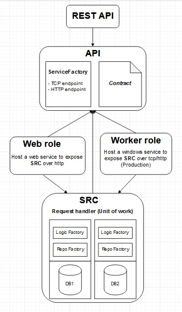

# Azure-WCF-Classic
This example demostrates how we can build an Azure Cloud Service (Classic) to host WCF using Worker role. There are 6 projects in the solution.

1. API - Contains a contract service.
2. SRC - Implements the API. 
3. WCF.AZURE - Azure clode service project which includes Worker role and Web role.
4. WCFWORKER - This is the worker role. It exposes SRC project as WCF using tcp port.
5. WCFWEB - This is the web role. It exposes SRC project using http.
6. RESTAPI - This is top level API. It can get data either from WCFWORKER or WCFWEB.

## Conceptual model

## How to run locally
  - Create two databases "HelloWorld" and "LoremIpsum". Create tables Cats, Dogs for the "HelloWorld" database and create table Tigers for LoremIpsum database. Each  table has only two columns (i.e., CatId, Color). Populate some default data.
  - Make sure to update the connection strings in WCFWORKER (App.config) with your local database host address. 
